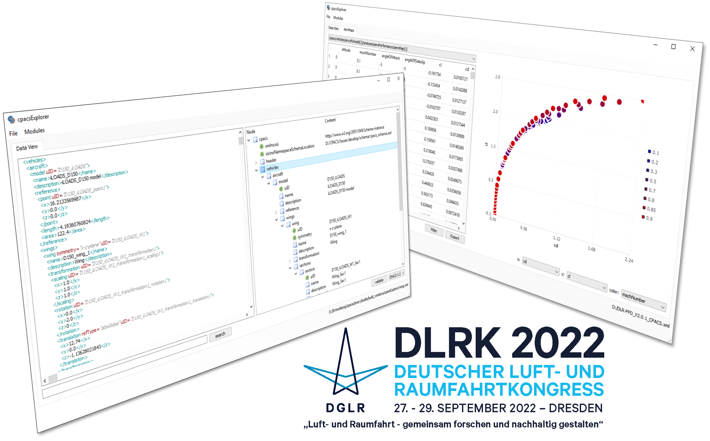

Title: Presentation of cpacsLibrary at DLRK 2022
Date: 2022-09-30 12:00
Category: Conferences
Author: Marko

At the DLRK congress in Dresden, the prototype of a new software library, called *cpacsLibrary*, was presented under the title:

** Development of a Software Library for Performant and Consistent CPACS Data Processing **

[Download](https://elib.dlr.de/190021/)

> The Common Parametric Aircraft Configuration Schema (CPACS) is increasingly used as a standard for data exchange in collaborative aircraft design projects involving many heterogeneous disciplines and expert knowledge. CPACS provides a hierarchical parametrization of fixed-wing aircraft and rotorcraft spanning from a detailed component level up to the interaction of the vehicle and its peripheral aviation system such as airline operations. Following the CPACS paradigm - data must be unique and explicit - all parameters are uniquely specified using an XML Schema Definition (XSD) which allows for a robust syntactic interpretation of the data. The transformation of this data (e.g., unit transformations of physical quantities) or the inference of additional information (e.g., interpolation of aerodynamic coefficients) usually requires rules and assumptions which are specified in a human interpretable format within the CPACS documentation. However, practical experience shows that even whilst having comprehensive documentation available, there is a potential source for inconsistency if such rules and assumptions are not available as standardized software implementations. While the TiGL geometry library serves as common software library for geometry data, other disciplines are lacking standardized approaches on how to infer knowledge from CPACS data. The present paper therefore introduces a software library called cpacsLibrary aiming to ensure consistent data handling in large collaborative aircraft design projects, and to enable an easier entrance into connecting models to CPACS as well as re-using implementations across disciplines. As it is tightly coupled to the development of CPACS itself and closely aligned with TiGL, \cpacsLibrary intends to complete the CPACS eco-system by providing standardized methods for non-geometric data handling. A detailed description of the software architecture comprises the implementation of low- and high-level methodologies in C++, test-driven development, version control, bindings to Python as well as data visualization strategies. The practical application of the library is demonstrated by the interpolation of irregular, multidimensional performance maps (aerodynamic and engine) stemming from disciplinary analysis tools in automated aircraft design processes applying Radial Basis Functions (RBF). The paper concludes by describing the future development roadmap, including opportunities for collaboration.

