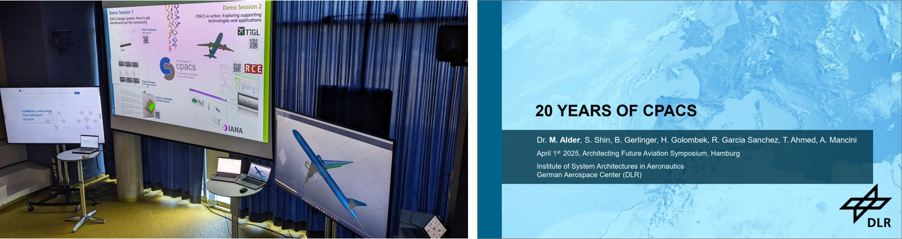
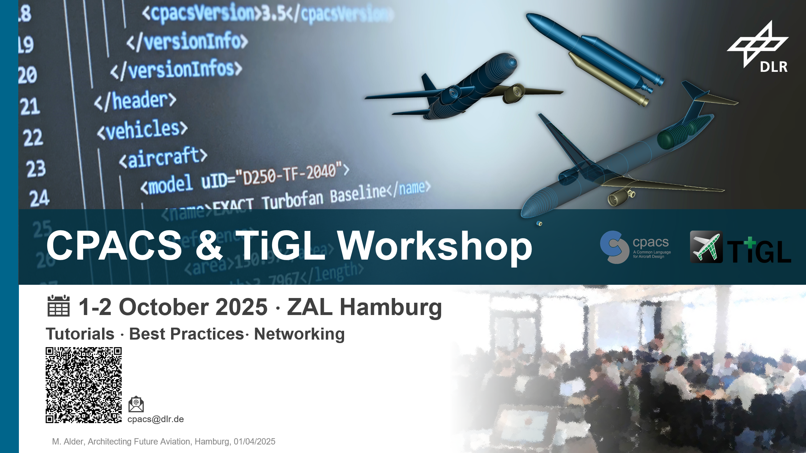

Title: 20 Years of CPACS Celebrated at Architecting Future Aviation Symposium  
Date: 2025-04-13 12:00  
Category: Conferences  
Author: Marko 

This year marks the 20th anniversary of **CPACS** as a common language in aircraft design that has become a de facto standard for data exchange collaborative in research and beyond. This milestone was highlighted during a dedicated session at the [*Architecting Future Aviation Symposium*](https://www.linkedin.com/posts/dlr-system-architectures-in-aeronautics_architectingaviation-sustainableaviation-activity-7315672838563139584-jSxj?utm_source=share&utm_medium=member_desktop&rcm=ACoAADNGAwgB9cvtZNh9FtVsoH1AWmBwTrH1Puo), hosted by the [German Aerospace Center e.V. (DLR)](https://www.dlr.de/de). Visitors were able to learn about the evolution of CPACS over the past 20 years, gain an insight into current developments and the future roadmap, and gain valuable insights into working with CPACS in two interactive demo sessions.

---

#### A Look Back at Two Decades of CPACS

CPACS started in 2005 as part of the **TiVA project** (*Technology Integration for the Virtual Aircraft*) with the goal of improving data exchange in multidisciplinary aircraft design. Over time, it developed into a broader ecosystem, including supporting software like [**TiXI**](https://github.com/DLR-SC/tixi), [**TiGL**](https://dlr-sc.github.io/tigl/), and [**RCE**](https://rcenvironment.de/), enabling complex workflows and cross-disciplinary collaboration.

Dr.-Ing. Marko Alder presented a timeline of CPACS’s development, from early tool integration with the Preliminary Aircraft Design software [PrADO](https://www.tu-braunschweig.de/en/ifl/simulation-tools/prado), through large-scale use in national research initiatives like [**EXACT**](https://exact-dlr.de/) and [**ALICIA**](https://event.dlr.de/ila2024/alicia/), to current work on digital continuity and systems-of-systems modeling.

*Note:* The presentation is available [here](https://elib.dlr.de/213574/).

---

#### Demo Sessions and Hands-On Examples

The CPACS anniversary session also featured two interactive demo sessions:

- **CPACS design system:** *How to get started and join the community*  
  *(Berit Gerlinger, Sooryun Shin, Hannes Golombek, DLR)*  
  An introduction to the CPACS Design System and training materials, including Jupyter notebooks and documentation.

- **CPACS in action:** *Exploring supporting technologies and applications*  
  *(Raúl Garcia, Marko Alder DLR)*  
  Showcased real-world applications with [TiGL](https://dlr-sc.github.io/tigl/) geometry modeling, the [RCE](https://rcenvironment.de/) integration platform, and DIANA for visual data analysis.

---

#### CPACS & TiGL Workshop – October 2025

To continue the exchange with users and developers, DLR is organizing a **CPACS & TiGL Workshop** from **October 1–2, 2025**, in **Hamburg**, hosted at [ZAL TechCenter](https://zal.aero/).

The workshop will bring together the teams behind **CPACS**, **TiGL**, and **TiXI** for two days of:

- Tutorials and hands-on sessions
- Discussions on best practices
- Opportunities to meet and network with the developer and user communities

The agenda will be announced soon. Anyone interested in joining is welcome to reach out already via **cpacs@dlr.de**.

---

#### Looking Ahead

CPACS continues to evolve as an de-facto standard for collaborative research on air transportation systems, used by researchers, students, and engineers across various domains. Events like the Architecting Future Aviation Symposium help maintain momentum and bring in fresh perspectives.

