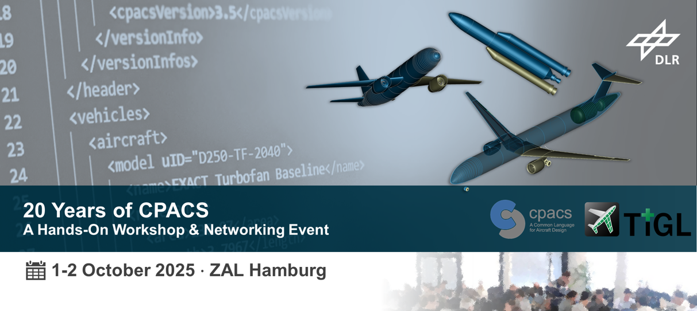

Title: Register Now: Interactive CPACS & TiGL Workshop
Date: 2025-06-17 12:00  
Category: Meetings  
Author: Marko

  <a href="https://dlr.expert/20-years-of-cpacs/front/kontakt.php" 
     style="
       background-color:#3D6CA4; 
       color:white; 
       padding:10px 20px; 
       text-decoration:none; 
       border-radius:5px; 
       font-weight:bold;
       display:inline-block;
     " 
     target="_blank" 
     rel="noopener noreferrer">
    Register Now
  </a>

To celebrate the 20th anniversary of CPACS, we are inviting researchers and engineers from industry, small-and medium-sized companies, research organisations, academia and think-tanks to join our event to: 

- get **exciting insights** into both, the **history and current developments of CPACS** and the connected [TiGL geometry software](https://dlr-sc.github.io/tigl/)
- receive **hands-on tutorials** and support during **practical exercises**
- have **great networking opportunities** and **gain new inspiration**

A **pre-workshop for CPACS-newbies** like students and young professionals will take place in the morning, offering in-depth hands-on experience of a digital engineering process using the CPACS Design System. This includes the CPACS data model, TiGL, and the Remote Component Environment (RCE).

If multidisciplinary design-optimisation is at the core of your work – come and **join us on 1-2 October 2025 at the [ZAL](https://zal.aero/en/) in Hamburg**: [**Register now**](https://dlr.expert/20-years-of-cpacs)!

#### CPACS in practice

If you are interested in learning how the CPACS Design System has been adopted in a European Clean Aviation project, we highly recommend registering for the preceding [**ODE4HERA workshop**](https://www.b2match.com/e/ode4hera-thematic-and-technological-workshop), taking place from 30 September to 1 October 2025 at ZAL Hamburg.
