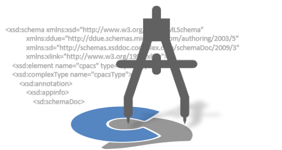

Title: Introduction of regular developer meetings
Date: 2021-11-18 16:00
Category: Meetings
Author: Marko

On November 18, we successfully kicked-off a new format of regular meetings concerning CPACS development.
A group of 15 participants from university, research institutions and industry discussed how the meetings can be organized efficiently.
We agreed on regular meetings at intervals of 13 weeks, in which general topics concerning CPACS, as well as the associated software libraries, will be discussed.

The slides from the meeting can be downloaded [here](/reports/2021_11_18_Quarterly.pptx). These include the result of a brainstorming session on the organization and content of the developer meetings.

The next meeting is scheduled for **February 17, 2022**. If you would like to actively participate in the regular developer meetings, **you are welcome to register via [e-mail](mailto:cpacs@dlr.de)**!
