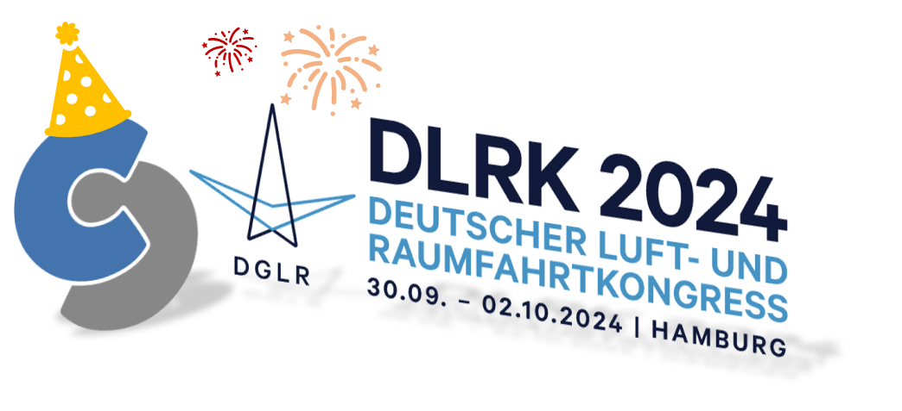

Title: 20 Years of CPACS: Anniversary at DLRK 2024  
Date: 2024-09-02 12:00  
Category: Conferences  
Author: marko  

At the **73rd Deutscher Luft- und Raumfahrtkongress (DLRK)**, held from **30 September to 2 October 2024** in **Hamburg**, the aerospace modeling community celebrated a major achievement: **20 years of CPACS (Common Parametric Aircraft Configuration Schema)**. This anniversary marked two decades of progress in advancing standardized, parametric design approaches for complex air transportation systems.

---

### From Concept to Standard in Aerospace

The CPACS initiative began in **2004** in response to the growing need for a common language between the various disciplines, experts and models in involved in collaborative aviation research. What started as exploratory discussions within DLR matured into the **TIVA project**, which laid the foundation for the CPACS Design System as we know it today - a common language with the supporting libraries [**TiXI**](https://github.com/DLR-SC/tixi) and [**TiGL**](https://dlr-sc.github.io/tigl/), and the model integration environment [**RCE**](https://rcenvironment.de/), enabling **multidisciplinary, collaborative design** across academia, research institutions and industry.

---

### Anniversary Highlights at DLRK

To commemorate this milestone, DLRK 2024 hosted a special session titled [**“20 Years of CPACS”**](https://elib.dlr.de/208791/), bringing together contributors, users, and newcomers for a reflective and forward-thinking look at CPACS's evolution.

- The session opened with an **overview presentation** tracing the development of CPACS from its inception to its current role in research and industry, and outlined a roadmap for future enhancements.
- This was followed by **three technical talks** demonstrating real-world applications:
    - [**Application of CPACS in Military Aircraft Design**](https://publikationen.dglr.de/?tx_dglrpublications_pi1%5Bdocument_id%5D=630288): Showcasing how CPACS is used in the design military aircraft concepts.  
    - [**Introduction of a system definition for the CPACS data schema**](https://elib.dlr.de/208380/): Expanding the schema to include detailed system-level modeling.  
    - [**Using CPACS for the multidisciplinary design and assessment of future aircraft concepts**](https://elib.dlr.de/207240/): Illustrating how CPACS is used in large-scale scenario modeling at airport and air transport system level.

---

### Broad Participation and Insightful Dialogue

CPACS also featured prominently in several other conference sessions, covering topics such as **knowledge-based engineering and custom geometry parametrization ([download](https://elib.dlr.de/210045/1/630078.pdf))** or **digital twin of the ISTAR research aircraft ([download](https://elib.dlr.de/208049/2/630368.pdf))**. These presentations reinforced the schema's growing relevance across disciplines and industries.

The event provided a valuable opportunity to engage with both new and experienced users — fostering collaboration, collecting feedback, and aligning on priorities for future development.

---

### Looking Forward

As CPACS enters its third decade, the community continues to expand—driven by a shared commitment to **open standards**, **interoperability**, and **sustainable engineering**. The anniversary session at DLRK was more than a celebration; it was a clear signal of momentum and purpose for the years ahead.

Stay connected for the latest developments and find out how you can contribute to shaping the future of CPACS.
