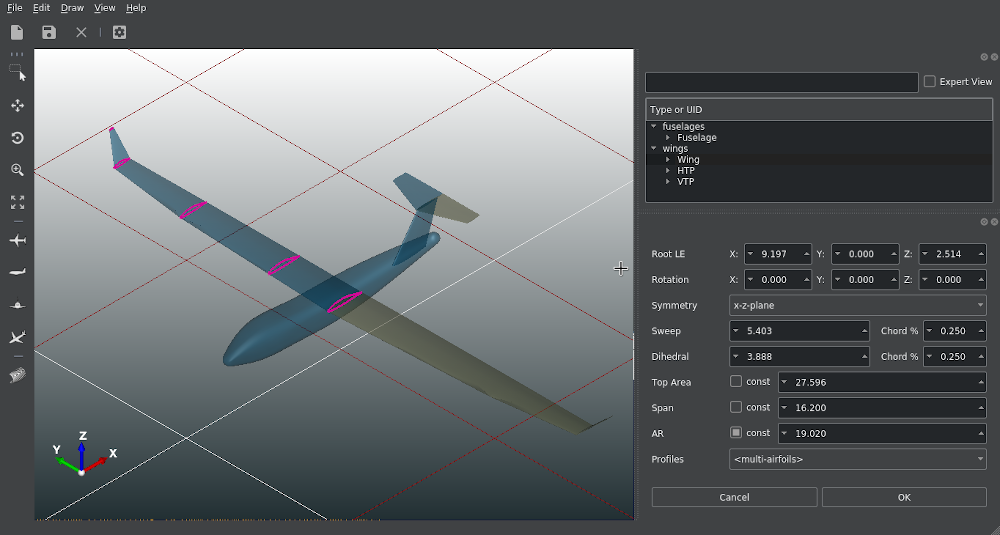

Title: CPACS Creator released
Date: 2019-09-28 12:00
Category: Related Software
Author: CPACS

The [CPACS Creator](https://dlr-sc.github.io/tigl/doc/cpacscreator-0.1/index.html), developed by Malo Grougard from CFS Engineering, can now be [downloaded](https://github.com/DLR-SC/tigl/releases/tag/cpacscreator-v0.1.1) and tested. It allows creating airplane configurations based on the CPACS parametrization from scratch using the TiGL-viewer. Furthermore, existing CPACS files can be loaded and directly edited. Detailed information on the functionality of the CPACS creator can be obtained at the [TiGL homepage](https://dlr-sc.github.io/tigl/cpacs-creator-pre-release.html).

We recommend that you put the software through its paces and look forward to your feedback afterwards. 