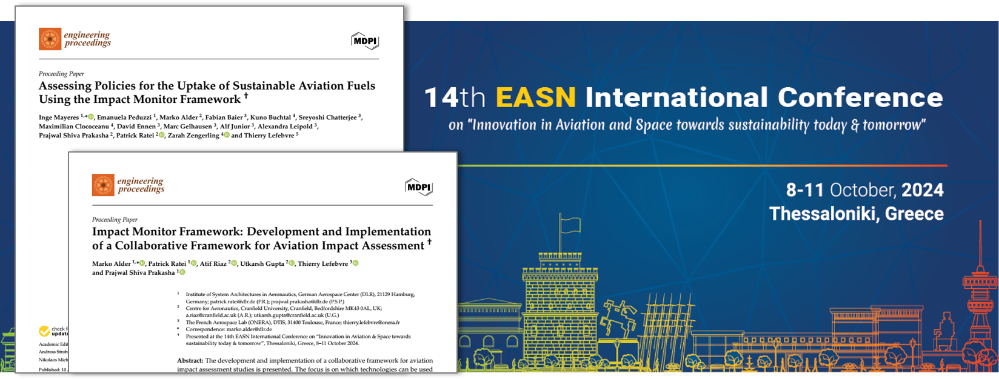

Title: CPACS Featured at EASN 2024: Two Peer-Reviewed Engineering Proceedings Published
Date: 2025-04-10 12:00  
Category: Conferences  
Author: marko 

At the **14th EASN International Conference on “Innovation in Aviation & Space”**, held from **8–11 October 2024** in **Thessaloniki, Greece**, CPACS played a central role in a series of sessions led by the [**EU-funded IMPACT MONITOR Project**](https://impactmonitor.eu/). The conference served as a key platform for sharing digital engineering frameworks that support sustainable, system-level aviation research. We are proud to announce that **two papers initially presented during the IMPACT MONITOR sessions have now been peer-reviewed and published** in the open-access journal [*Engineering Proceedings*](https://www.mdpi.com/2673-4591/90/1).

---

### From Conference Presentation to Publication  

The two papers were first presented during dedicated sessions hosted by the IMPACT MONITOR project at EASN, which featured technical demonstrations and key results from institutions including DLR, ONERA, Cranfield University, and Transport & Mobility Leuven. The sessions were moderated by **Hugues Félix ([CINEA](https://cinea.ec.europa.eu/index_en))** and offered attendees deep insight into collaborative tools and workflows for aviation impact assessment. Both papers have now undergone peer review, reinforcing their relevance to the broader research and innovation community.

---

### A Framework for Holistic Impact Assessment  

The publication [**“Impact Monitor Framework: Development and Implementation of a Collaborative Framework for Aviation Impact Assessment”**](https://doi.org/10.3390/engproc2025090061) describes a distributed, collaborative environment for assessing environmental and societal impacts in aviation. Built on [CPACS](www.cpacs.de), [TiXI](https://github.com/DLR-SC/tixi), [TiGL](https://dlr-sc.github.io/tigl/), and the [RCE](https://rcenvironment.de/) platform, the framework enables structured, secure data workflows and includes an interactive dashboard for visualizing results across multiple domains.

---

### Evaluating SAF Policies at System Level  

In [**“Assessing Policies for the Uptake of Sustainable Aviation Fuels Using the Impact Monitor Framework”**](https://doi.org/10.3390/engproc2025090095), the Impact Monitor Framework is applied to simulate and evaluate international policy scenarios regarding SAF (Sustainable Aviation Fuel) adoption. Using a CPACS-integrated toolchain that includes models for the analyses of flight schedules, emissions, and economic impacts of policies, the study demonstrates the framework’s potential for analyzing complex trade-offs between emissions and economic effects of policies.

---

### About the IMPACT MONITOR Project  

[**IMPACT MONITOR**](https://impactmonitor.eu/home) is a project funded by the European Union and coordinated by the **German Aerospace Center (DLR)**. Its mission is to develop a **coherent, holistic impact assessment framework and toolbox** to support the **European Commission** in evaluating the environmental, economic, and societal effects of aviation research and innovation. Focusing on greenhouse gas emissions, local air quality, and noise, the project delivers collaborative digital technologies for impact assessments across **aircraft, airport, and air transport system levels**.

By building on prior EC projects like **TEAM_Play**, **Clean Sky TE**, and **AGILE/AGILE4.0**, the project enhances the scientific foundation for policy and technology decisions aligned with EU sustainability goals.

---

### Looking Ahead  

The peer-reviewed publications mark a significant milestone for CPACS and the Impact Monitor initiative. With expanding capabilities for system-of-systems analysis and growing adoption across research domains, CPACS continues to serve as a vital enabler of **interoperable, scalable, and policy-relevant impact assessment** in European aviation.

Access the full articles:  
📄 [Impact Monitor Framework](https://doi.org/10.3390/engproc2025090061)  
📄 [SAF Policy Assessment](https://doi.org/10.3390/engproc2025090095)
