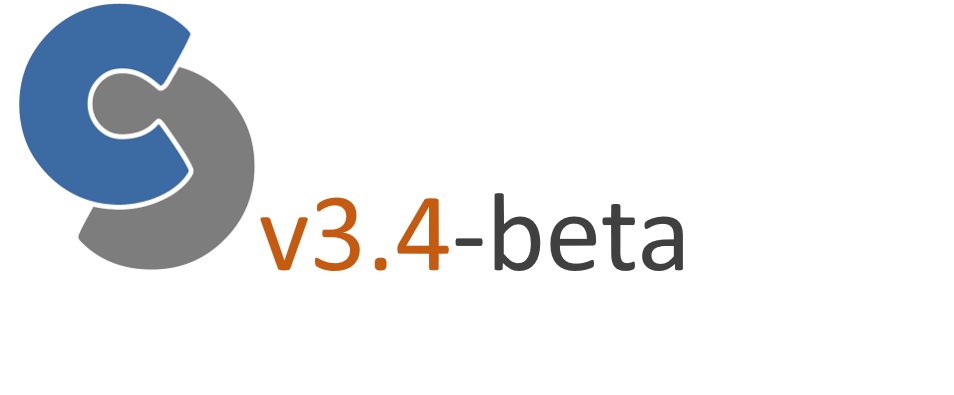

Title: CPACS 3.4-beta
Date: 2021-11-19 15:00
Category: Releases
Author: Marko

     
The extensive work on CPACS over the last few months has been released as v3.4-beta.  

- [Download](https://github.com/DLR-SL/CPACS/releases/tag/v3.4-beta)
- [Online documentation](https://www.cpacs.de/documentation/CPACS_3_4_beta/index.html)
- [Progress board](https://github.com/DLR-SL/CPACS/projects/7) & [Milestone list](https://github.com/DLR-SL/CPACS/milestone/8)

As part of the [release process](https://www.cpacs.de/pages/contribute.html), we have had a stakeholder meeting on the new decks and floor structures definition (more information can be found [here](https://www.cpacs.de/cpacs-stakeholder-meeting-on-decks-definition-and-floor-structures.html)) and will review the remaining topics in the upcoming developer meeting. 
If you are interested in participating in one of the topics listed [here](https://github.com/DLR-SL/CPACS/releases/tag/v3.4-beta), please send us an [e-mail](mailto:cpacs@dlr.de) and we will gladly provide you with further information.
Invitations for the next parts of the release process will be sent out via the CPACS mailing list ([you can subscribe here](https://www.cpacs.de/pages/contact.html)).

We would like to request the community to test the new CPACS version thoroughly and to share experiences and requests for further adoptions on [GitHub](https://github.com/DLR-SL/CPACS). Thank you!