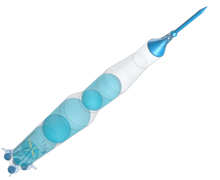

Title: CPACS v3.5.1 published
Date: 2026-09-04 10:00
Category: Releases
Author: Marko

<figure style="position: relative; max-width: 430px; margin: 0 auto 2.2rem; text-align: center;">

Saturn&nbsp;V
NASA&rsquo;s Apollo Moon launcher, 1967&ndash;1973

</figure>

CPACS v3.5.1 is out. Going by the version number this looks like a small patch, but it turned out to be a bit more than that. Three areas have been reworked: `systems` and `fuelTanks`, both introduced with v3.5, and `decks`, which has been part of CPACS for a good while longer and is now brought in line with them. All of it based on the first implementation experience and on the feedback we collected during the stakeholder review in May.

**Systems.** Refined geometry for the predefined `systemElements`, `multiSegmentShapes`, references to external CAD, combined shapes with individual transformations, and no more aircraft-level scaling when a generic system is instantiated.

**Decks.** Deck elements now use the same geometry building blocks as systems. The `boundingBox` approach is gone, transformations are consistently 3D, and cargo containers are treated as regular deck elements.

**Fuel tanks.** Vessel-based tanks moved to `vehicles/aircraft/model/fuelTanks` and are placed via `parentUID`, so they can sit in fuselages, wings, nacelles or any other geometry component. The internal tank definition was restructured, and structural definitions on vessel level are properly supported now.

On top of that, the example files were updated and consolidated.

<strong>Please note:</strong> the refinements of <code>systems</code>, <code>decks</code> and <code>fuelTanks</code> are <strong>not</strong> backward compatible with CPACS 3.5. Datasets that use these nodes need to be adapted. The rest of the schema is untouched.

## Hand in hand with TiGL

CPACS v3.5.1 and [TiGL v3.5.0](https://github.com/DLR-SC/tigl/releases/tag/v3.5.0) were developed and released together, which is how these things should work. Schema changes were tried out in TiGL while they were still up for discussion, and more than one detail of the new tank and deck definitions went back to what we learned there. TiGL v3.5.0 conforms to CPACS 3.5.1, brings the systems definition, geometry and mass properties for fuselage decks, ducts cut out of tank vessels, leading edge devices, and a long list of TiGLCreator improvements. If you work with the new nodes, this is the release you want next to CPACS.

## New documentation

We also took the opportunity to rebuild how the schema documentation is published. CPACS 3.5.1 comes with an online schema browser: a navigable tree over all 1,198 types and 53,691 instance paths, with full-text search. Nothing to download, nothing to unblock, the same on Windows, Linux and macOS — and every node has an address you can put into a mail or an issue.

The familiar formats are still there. Next to the browser you will find the classic pages, the `.chm` for offline use, and a single-file HTML version that opens on any system without the Windows security dance. Have a look at the [documentation page](https://cpacs.de/pages/documentation.html) — feedback on the new format is very welcome, this is a first iteration.

## Why a Saturn V

For the new systems and tank definitions we wanted a demonstration case that is properly complex and that we can share without restrictions. The Saturn V fits both. There is a lot of published data on it, and none of it is tied up in licences or export rules, so the whole dataset can sit in a public repository and anyone can open it. It describes the complete launcher — three stages, six cryogenic tanks, feed systems with pressurisation and anti-slosh baffles, structural sections and engine shrouds — with the geometry rendered by TiGL. Dataset, export scripts and a small web viewer are in the [SaturnV-CPACS repository](https://github.com/DLR-SL/SaturnV-CPACS).

Building it showed quite clearly where CPACS reaches its semantic limits once you leave the aircraft domain, and it handed us a concrete list of things to improve. Most of them went straight back into this release: ducts are now cut out of tank vessels as well, and tori are available as geometric primitives. Both came directly out of modelling the launcher, and both are just as useful for aircraft.

The example is also simply motivating to work on, and we think cases of this size carry more into practice than a minimal test file does. If you want to see what the new nodes can carry, this is a good place to start.

## Relevant links

- [Release notes on GitHub](https://github.com/DLR-SL/CPACS/releases/tag/v3.5.1) and the [3.5.1 project board](https://github.com/orgs/DLR-SL/projects/3)
- [Download](https://dlr-sl.github.io/cpacs-website/pages/get-cpacs.html)
- [Documentation](https://cpacs.de/pages/documentation.html)
- [TiGL v3.5.0](https://github.com/DLR-SC/tigl/releases/tag/v3.5.0)
- [Saturn V example dataset](https://github.com/DLR-SL/SaturnV-CPACS)
- [Q&A forum](https://cpacs.de/pages/forum.html) for questions and discussions

Many thanks to everyone who contributed to the extended schema — through the two review rounds, the stakeholder meeting in May, the issue discussions, and the implementation work that kept the proposals honest. Extending CPACS into systems and tanks was a considerable amount of work, and it only holds up because so many of you took the time to try it on real data and tell us what did not fit. Thanks as well to the TiGL team for the close coordination throughout.

And with that, on towards v3.6!
