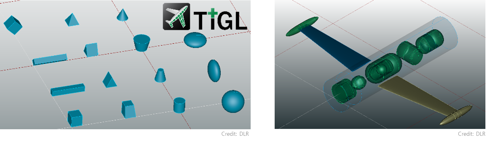

Title: CPACS Stakeholder Meeting – v3.5.1 & TiGL v3.5
Date: 2026-04-21
Category: Meetings
Author: Marko

     

We are inviting the CPACS community to join our upcoming **CPACS Stakeholder Meeting**, focused on the proposed refinements for the **v3.5.1 release** and the upcoming release of our geometry library **[TiGL](https://dlr-sc.github.io/tigl/) v3.5**.

**📅 Date:** Tuesday, 19 May 2026  
**🕤 Time:** 9:30 – 11:30 (CET)  
**💻 Platform:** Webex (online)

The meeting will address three refinement proposals that are currently under review:

* **Systems ([#858](https://github.com/DLR-SL/CPACS/issues/858))** – Refined geometry definition for pre-defined system elements and revised component placement at aircraft level.
* **Decks ([#859](https://github.com/DLR-SL/CPACS/issues/859))** – Closer alignment of `deckElements` with the systems concept and replacement of the `boundingBox` approach with primitive-based geometry.
* **Tanks ([#860](https://github.com/DLR-SL/CPACS/issues/860))** – Vessel-based tanks moved to aircraft/model level via `parentUID`, with support for placement in fuselages, wings, nacelles, and other geometry components.

These proposals build on the capabilities introduced in CPACS v3.5 and reflect first implementation experience from the community.

In addition, we will give an outlook on **TiGL v3.5**, which is planned as a hand-in-hand release with CPACS v3.5.1, providing support for the new schema features.

Please find the [**info sheet**](images/documents/MeetingInfo.pdf) for a detailed overview of the proposed changes and the key review questions.

If you would like to participate, please send a short request to **[cpacs@dlr.de](mailto:cpacs@dlr.de)** and we will provide you with the meeting access details.

We look forward to your participation and a productive discussion!