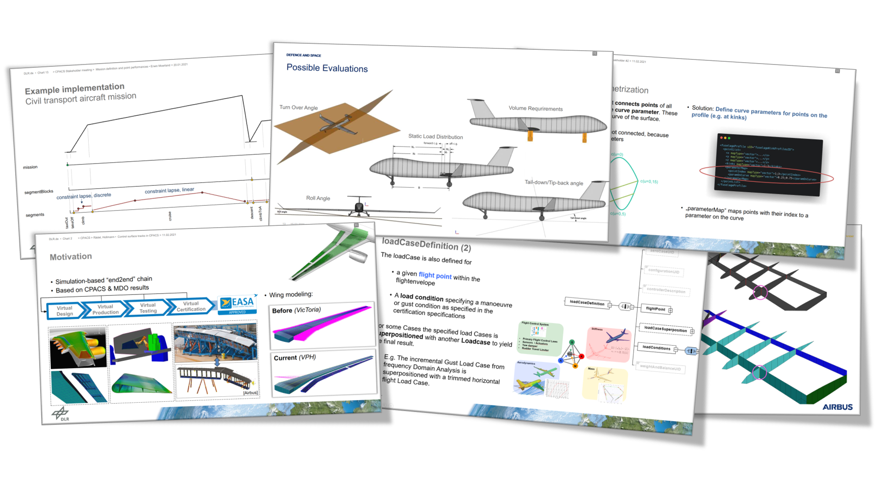

Title: Successfull CPACS Stakeholder Meeting
Date: 2021-03-01 16:00
Category: Meetings
Author: marko

     
Spread over Jan. 20 and Feb. 11 2021, the stakeholder meeting on the upcoming CPACS 3.3 Relase candidate took place. 
It was particularly nice to see the large participation of the community from various research institutions, universities and industry. 
Among them were, for example, Airbus Defence & Space, Bauhaus Luftfahrt, NLR, TUHH, Università del Salento, TU Braunschweig and various DLR institutes. 

Detailed presentations by those responsible for individual topics and first reports on practical experience with the beta version published in November 2020 brought all participants up to a uniform level of information and identified the final details requiring revision.

I invite everyone to take a look at the [GitHub issue board](https://github.com/DLR-SL/CPACS/issues) to actively participate in the final activities towards the CPACS 3.3 release. 

