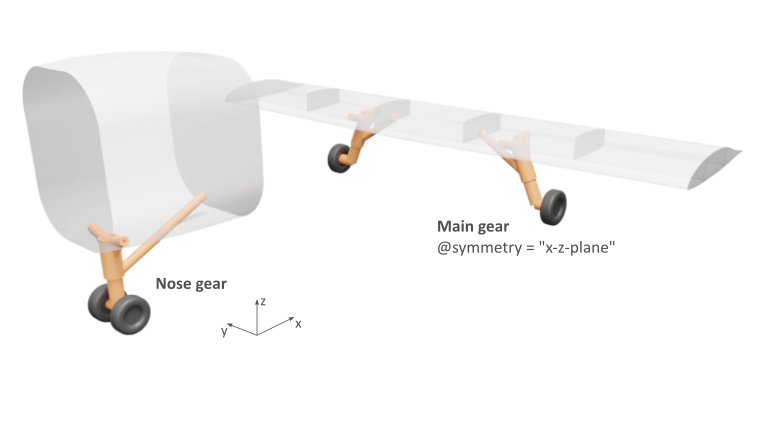

Title: Working groups on aeroLimitMaps and landingGears
Date: 2021-03-03 16:00
Category: Meetings
Author: marko

     
One result of the last stakeholder meetings is that we set up two working groups, one on the **aeroLimitMaps** ([#687](https://github.com/DLR-SL/CPACS/issues/687)) and one on the new **landingGears** ([#693](https://github.com/DLR-SL/CPACS/issues/693)) definition, to discuss the remaining issues in more detail. 

We are looking forward to a lively participation. So feel free to [contact us](https://www.cpacs.de/pages/contact.html) for the dates and a link to participate.

